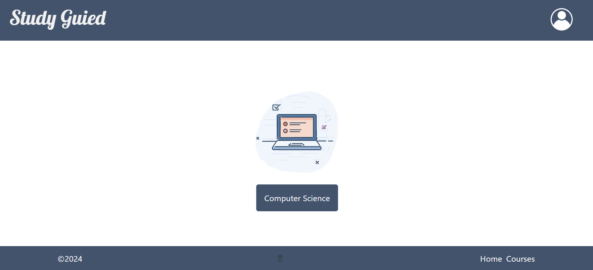
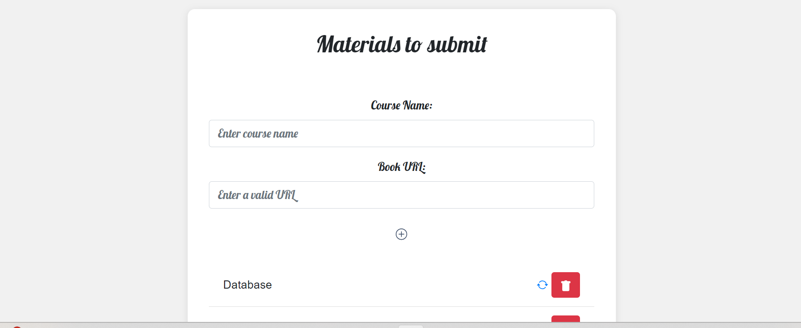
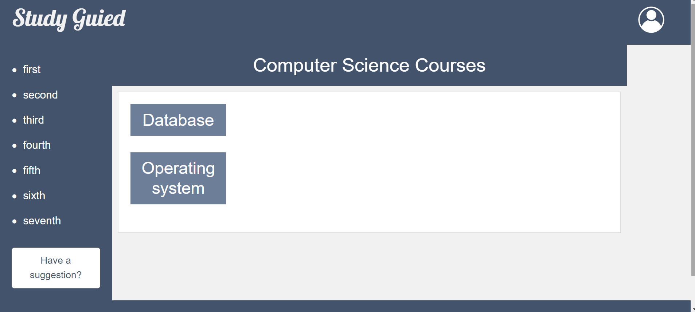

# Overview
This project is a comprehensive resource hub for computer science students, providing access to books for various courses. The system is designed to help students easily find and access essential textbooks for their major, making it easier to study and prepare for exams.

# Website Flow Chart

## 1. Homepage Flowchart

The homepage provides an entry point for users to access the main content of the website. It features:
- A button to navigate to the **Computer Science** section.
- In the top right corner, there is a login button for admins, which leads to the **Admin Login** page.

## 2. Admin Page Flowchart

The admin page is accessible only to logged-in administrators. From this page, admins can:
- Update and manage the website’s resources (e.g., upload new tutorials, update slides).

## 3. Main Page Flowchart (Levels)

The main page contains the different **levels** for the computer science program. Each level includes:
- **Books**: Textbooks or reference materials for the course.
- **Slides**: Lecture slides for each topic.
- **Helpful Resources**: Additional tutorials, videos, or links to external resources.

 ## 4. Level Resources Page Flowchart

 

Each level's resources page displays:
-A list of books specific to the selected level.
-Users can browse and download the available books for that level.

# Setup

 In order to obtain the resources:
1.<git clone https://github.com/LeenMusaadd/StudyGuide/tree/master>` is the first step in cloning the repository.
2. To view all of the course resources on the homepage, open the `HomePage.html` file in your browser.

# Technology Used

- **HTML**: For the structure and layout of the web pages.
- **CSS**:  To ensure the responsiveness and style of the pages.
- **JavaScript**:  For the interactivity and functionality of the site (e.g., loading books, filtering resources).
- **Node.js**: utilized for managing requests between the frontend and the database, controlling backend logic, and server-side scripting.
- **MongoDB**:The books for every course, along with administrative data, are stored and retrieved using a NoSQL database.

# Goals

These are the website's main objectives:
1.To offer a centralized site where computer science students can access books for their classes.
2.To develop an interface for administrators to efficiently manage book listings and keep the site updated.
3.To help students easily access books for particular courses by allowing them to navigate by course level.

# Future Work

1.Search Functionality: provide an advanced search function that lets users separate materials based on keywords, course names, or other criteria.
2.User Accounts: Add user accounts so that students can save their favorite resources or track their progress.

# Resources

bootstrap :https://getbootstrap.com/docs/5.2/examples/footers/
Nodjs: https://nodejs.org/en/docs/

# Team Members

-Leen  Albishri
-Shoug Alharbi
-Randa Alsubaie
-Lulu Altuwijri
